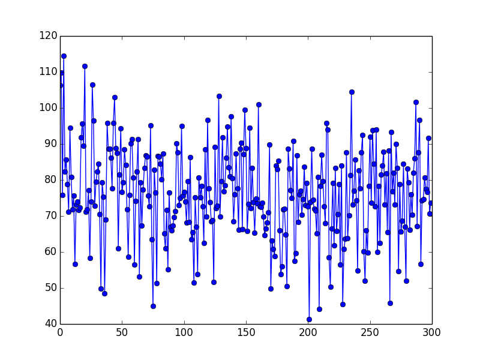

*A Malmo Project for CompSci 175 at UC Irvine*

<iframe src="https://www.youtube.com/embed/w_hhVbIIH90" width="640" height="360" frameborder="0" style="position:absolute;width:100%;height:100%;left:0" allowfullscreen></iframe>

Work in Progress (・`ω´・)
The video is still the status report video, just a placeholder while we are working on the structure for the final report. .....

## Project Summary

The Survival of the Fittest Project (Our Computer Sciences 175: Project in AI) provide an opportunity for our team to design several agents to survive in a complex environment with numerous enemies. From the day one, the team dedicate to an unchanged objective – find, design, and train the best agent to survive in an unpredictable and sophisticated environment to pursuit the goal of longevity.

#### Essential Knowledge
The project requires us to review, comprehend, and implement what we have learned in CompSci 175, and several other Intelligence System courses – CompSci 171, CompSci 177, and CompSci 178. The project utilized Neural Network, Q-Learning, and Neuroevolution of Augmenting Topologies to generate three different agents. Deep Q Network provided the most readily available solution. A neural network delivers an estimation of Q value, and then the agent would determine the best action based on the Q value. Another agent whom the team has been working on is NEAT (Neuroevolution of Augmenting Topologies). NEAT has presented various challenges during the development. It is a powerful method, but the team only has limited knowledge on the subject. Beside Deep Q Network and NEAT, a random agent whose actions are solely determined by unplanned actions without any heuristics. The random acts as a control group to evaluate the performance of other agents by comparing the performance.

#### Progress Summary  

As described in our Status Report, the team had created an agent with Deep Q Network whom can tackle the task of surviving from one Zombie in a limited cage. Since then, the team has been working on improving the performance of the agent. The MSE – Mean Squared Error – of the Deep Q Network agent shows an ambiguous result, as described in the Status Report. Now, the improvement of performance can be undoubtedly demonstrated by a chart (in-depth demonstration in Evaluation section).

NEAT (Placehoder ..... nothing yet)

A set of 21 by 21 wall defined the initial playground for the agent and the zombie in the early stage of agent development, while the scope of our agent is only 11 by 11. The limited environment provides a suitable testing ground for our task. Hence, the identical background would repeatedly appear during the training process to a reduce the learning workload for the agents. After the agents can fulfill their task in the predefined environment, the team develops a randomized environment to enlarge the available map space and with more diverse enemy variety.

## Approach

### Environment Representation / Actions / Reward

 

Comparing to the previous version, where our agent tries to survive inside a 21-by-21 cage with one enemy shown as above, we update the complexity of the environment.

| Tables        | Are           | 
|------------------------------------------------------:|:------------------------------------------------------:|
| |  |
|------------------------------------------------------:|:------------------------------------------------------:|
| |  |

The environment our agent can see is also a 21-by-21 matrix where the agent itself is located at the center of the matrix (matrix[10][10]) at the very beginning.

To simplify the state, we use 1 to represent enemy, 0 to represent both the agent and the air, and -1 to represent block. For each state, there are four associated actions: left (represented by 1), right (represented by 2), up (represented by 4) and down (represented by 8). 

Reward for each state and action depends on three criteria: angen's current health, distance between agent and closest enmey (only one enemy for now), distance between agent and cloest wall. The agent will be rewarded less if it's attaced by enemy and lose health (-0.5). The agent will have points deducted (-0.2) if the distance between the agent and the cloeset enemy is less than 2.0 because it is probaly within the enemy's attack range. Also, the distance between the agent and the cloest wall is crucial as well (-0.1 if the distance is less than 1.0), because the closer the agent and the wall is, the more likely the agent is attacked by the enemy.

Of course, the agent will be rewarded if it is able to make a move that increase the distance between enemy (+0.3) or distance between wall (+0.2) and some extra rewards if it is able to keep a long distance for a period of time. 

Notes: the total reward is within the range of (-1, +1) becasue we use tanh as the activation function.

### Algorithm

We are using Deep Q Network algorithm to train our agent. Here is a good graphic representation of the training process, excpet we do not need to convolute the game state since we already represent the state with matrix:

The basic idea of Deep Q Network is similar to that of the Q-Learning where we have a reward (Q-Value) associated with a state and each of its corresponding action(s). Then we select the action which possesses the maximum Q-Value among all options.

However, Q Learning is not a feasible approach in our case, since the state is too large and complicated. With a map size of 21 * 21 and three possible entities on each block of map, our program will require gigabytes of space to store a Q-Table (3^441 possible states and 4 actions for each state).

Hence, alternatively, we decided to use Deep Q Network, in which the Q-Function is represented by a Neural Network. It takes the state (matrix) and four actions as inputs, and it outputs the Q-Value for each possible action. Fianally, the agent can pick the action with the most optimized predicted Q-Value and follow it.

For our implementation of Neural Network, we have one input layer with 442 nodes (21 * 21 matrix that represent the current state and 1 value that represent the action), three hidden layers and a output layer with one node. We use hyperbolic tangent as the activation function so the predicted output will be within the range of (-1, 1). 

What truly seperate Deep Q Network with other reinforcemnet learning algorithm is its ability to "replay".
The pseudocode of replay function is shown as follow:

 

As shown in the pseudocode shown above, the experience <previous_state, previous_action, reward, current_state> is stored each time the agent made a move. To implement this function, we use a list (will probably change to deque in the future) to memory the past experience. Once an episode is ended, a small batch of random experience is retrieved from the list and we use stochastic gradient descent to update the weights of Neutral Network based on these experiences. This method can not only help our agent avoiding local minium but also improve and stable the agent's performance since the reward for each state is discrete instead of continuous.

## Evaluation
For now, we use the Mean Square Error between the actual Q-Value and the predicted Q-Value to evaluate our agent's performance.
Here's an MSE for our first 300 episode.

 

Even though the total survival  time for our agent is gradually improving (from the 20s to 30s after 300 episode). The MSE for during this period does not decrease a lot as we expected. One reason might be that the way we assign a reward to each state and its associated  action is too complicated for the Neural Network to learn and approximate. The other reason might be that the learning rate is too small (0.01 as we generated this picture) so that we can hardly see significant  improvements within 300 episode. Therefore, finding a better way to assign reward and a more straightforward evaluation method is a major focus before the final.

## Reference

#### Neural Network

##### The Training Function

##### The Score Calculation

[Shaikh, Faizan, Nss, Guest Blog, and Dishashree Gupta. "An Introduction to Implementing Neural Networks Using TensorFlow." Analytics Vidhya. N.p., 23 Jan. 2017. Web.](https://www.analyticsvidhya.com/blog/2016/10/an-introduction-to-implementing-neural-networks-using-tensorflow/)

#### Deep Q Network
[GitHub. Deep Reinforcement Learning: Pong from Pixels, 13 May 2016. Web.](http://karpathy.github.io/2016/05/31/rl/)

#### NEAT
