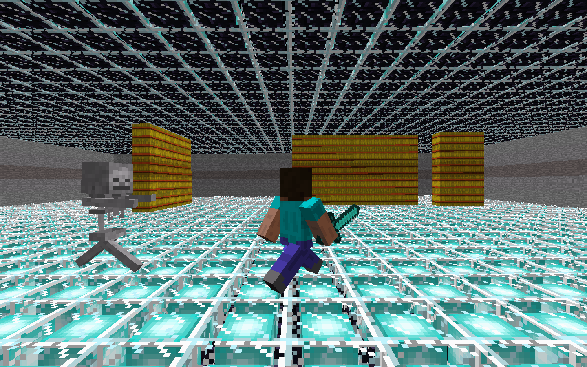
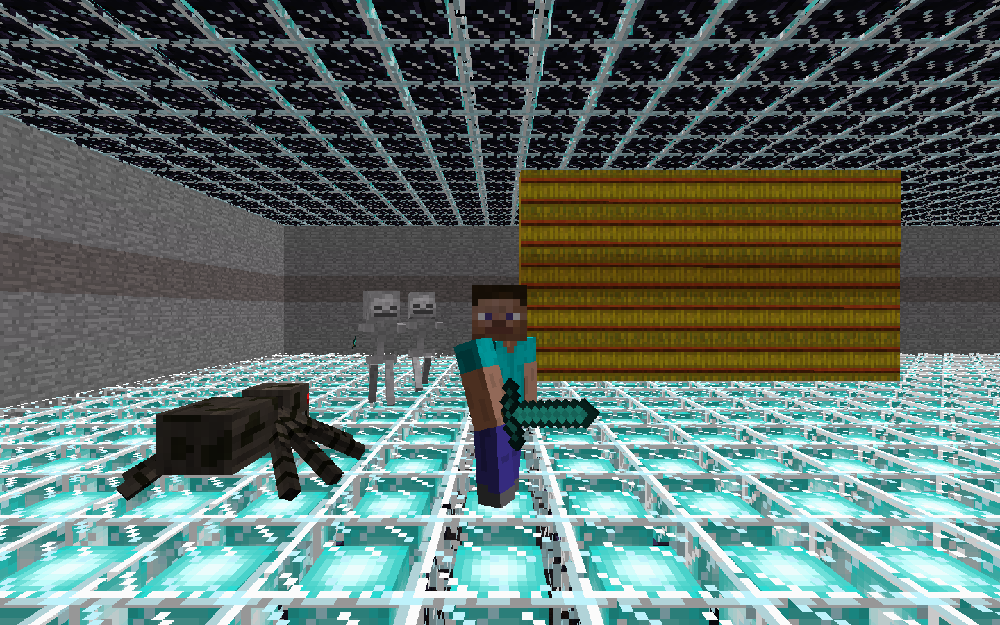
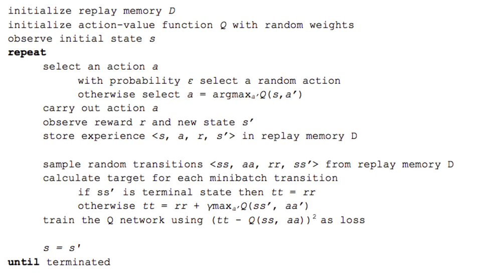

*A Malmo Project for CompSci 175 at UC Irvine*

<div style="position:relative;height:0;padding-bottom:56.25%"><iframe src="https://www.youtube.com/embed/w_hhVbIIH90" width="640" height="360" frameborder="0" style="position:absolute;width:100%;height:100%;left:0" allowfullscreen></iframe></div>

Work in Progress (・`ω´・)
The video is still the status report video, just a placeholder while we are working on the structure for the final report. .....

## Project Summary

The Survival of the Fittest Project (Our Computer Sciences 175: Project in AI) provide an opportunity for our team to design several agents to survive in a complex environment with numerous enemies. From the day one, the team dedicate to an unchanged objective – find, design, and train the best agent to survive in an unpredictable and sophisticated environment to pursuit the goal of longevity.

#### Essential Knowledge
The project requires us to review, comprehend, and implement what we have learned in CompSci 175, and several other Intelligence System courses – CompSci 171, CompSci 177, and CompSci 178. The project utilized Neural Network, Q-Learning, and Neuroevolution of Augmenting Topologies to generate three different agents. Deep Q Network provided the most readily available solution. A neural network delivers an estimation of Q value, and then the agent would determine the best action based on the Q value. Another agent whom the team has been working on is NEAT (Neuroevolution of Augmenting Topologies). NEAT has presented various challenges during the development. It is a powerful method, but the team only has limited knowledge on the subject. Beside Deep Q Network and NEAT, a random agent whose actions are solely determined by unplanned actions without any heuristics. The random acts as a control group to evaluate the performance of other agents by comparing the performance.

#### Progress Summary  

As described in our Status Report, the team had created an agent with Deep Q Network whom can tackle the task of surviving from one Zombie in a limited cage. Since then, the team has been working on improving the performance of the agent. The MSE – Mean Squared Error – of the Deep Q Network agent shows an ambiguous result, as described in the Status Report. Now, the improvement of performance can be undoubtedly demonstrated by a chart (in-depth demonstration in Evaluation section).

NEAT (Placehoder ..... nothing yet)

A set of 21 by 21 wall defined the initial playground for the agent and the zombie in the early stage of agent development, while the scope of our agent is only 11 by 11. The limited environment provides a suitable testing ground for our task. Hence, the identical background would repeatedly appear during the training process to a reduce the learning workload for the agents. After the agents can fulfill their task in the predefined environment, the team develops a randomized environment to enlarge the available map space and with more diverse enemy variety.


## Approach

### Environment Representation / Actions / Reward

 

Comparing to the previous version, where our agent tries to survive inside a 21-by-21 cage with one enemy shown as above, we update the complexity of the environment. We are able to set the environment dynamically based on what we need. For example, in the following images, the environment is set to be a 41-by-41 cage with wall inside the cage. Besides the size of the environment, we also introduce two more types of entities, Spiders, which rarely move but would harm agent if agent steps onto them, and Skeletons, which are mostly identical to Zombies but can move much faster. 

|                                    |                                    |
|:----------------------------------:|:----------------------------------:|
|{:height="50%" width="50%"}  |  {:height="50%" width="50%"}|
|{:height="50%" width="50%"}  |  {:height="50%" width="50%"}|


The environment our agent can see is changed from a 21-by-21 matrix to a 11-by-11 matrix where the agent itself is located at the center of the matrix (matrix[5][5]) at the very beginning. The reason why we choose a 11-by-11 matrix is that the reducing of the state size help accelerate the training process. But if we have a state that is too small, the training result will likely to be overfitted. (We will show that later in the Evaluation part)

Reward for each state and action only depends on two criteria: agent's current health and distance between agent and closest enemy. Distance between closest wall is no longer a depending criterion because we introduce wall into the updated environment and we would like to see how our agent can utilize wall to escape from the enemies. The agent will be rewarded less if it's attacked by enemy and lose health (-0.5). The agent will have points deducted (-0.2) if the distance between the agent and the closest enemy is less than 2.0 and will have more points deducted (-0.3) if agent choose a move that shorten the distance between agent and closest enemy.
Of course, the agent will be rewarded if it is able to make a move that increase the distance between enemy (+0.3) and some extra rewards if it is able to keep a long distance for a period of time.

Notes: the total reward is within the range of (-1, +1) becasue we use tanh as the activation function.


### Algorithm

#### Algorithm Illustration 

We are using the same algorithm, Deep Q Network algorithm, as we did in previous version to train our agent. Here is a good graphic representation of the training process, excpet we do not need to convolute the game state since we already represent the state with matrix:


The basic idea of Deep Q Network is similar to that of the Q-Learning where we have a reward (Q-Value) associated with a state and each of its corresponding action(s). Then we select the action which possesses the maximum Q-Value among all options.

However, Q Learning is not a feasible approach in our case, since the state is too large and complicated. With a state size of 11 * 11 and three possible entities on each block of map, our program will require gigabytes of space to store a Q-Table (3^121 possible states and 4 actions for each state).

Hence, alternatively, we decided to use Deep Q Network, in which the Q-Function is represented by a Neural Network. It takes the state (matrix)as inputs, and it outputs the Q-Values for each possible action. Finally, the agent can pick the action with the most optimized predicted Q-Value and follow it.

What truly separate Deep Q Network with other reinforcement learning algorithm is its ability to "replay".
The pseudocode of replay function is shown as follow:

 

As shown in the pseudocode shown above, the experience <previous_state, previous_action, reward, current_state> is stored each time the agent made a move. To implement this function, we use a list (will probably change to deque in the future) to memory the past experience. Once an episode is ended, a small batch of random experience is retrieved from the list and we use stochastic gradient descent to update the weights of Neutral Network based on these experiences. This method can not only help our agent avoiding local minimum but also improve and stable the agent's performance since the reward for each state is discrete instead of continuous.


#### Improvement In Updated Version

In the previous version, for our implementation of Neural Network, we have one input layer with 442 nodes (21 * 21 matrix that represent the current state and 1 value that represent the action), three hidden layers and a output layer with one node. We use hyperbolic tangent as the activation function so the predicted output will be within the range of (-1, 1). 

In the updated version, we changed the size of input layer to a layer with 121 nodes, since the environment states is changed to a 11-by-11 matrix and we remove the node that representing action. Instead, we produce a output layer with 4 values, one for each action (up, down, left, right). A graphic illustration of the new changes would be as follow:

 

As we stated in the status report, we noticed that, for a given state, the Q-Values predicted for four possible actions are quite similar. The reason for this problem is that, as we use a node in input layer to represent an action, the predictor can hardly distinguish whether it is part of state or an action and, therefore, produce identical predicted Q-values for all possible actions.
After the modification, we can not only guarantee that training improvements can be shared among all possible actions' predictions but also make sure that the predictor will provide dissimilar Q-Values for each action.

Besides the improvements
### Baseline Agent

#### Random Action Agent
Agent that choose next action randomly

```python
   def choose_action(self, curr_state, possible_actions):
        if not possible_actions:
            return random.choice(possible_actions)
        else:
            return random.choice([0, 1, 2, 3])
```
Comparing to our optimal agent, random action agent survive less than 10 seconds.

#### Mob Fun Agent
Agent that searches for best angles to move based on the surrounding entities (modified based on mob_fun.py provided by Malmo Project)
```python
def getBestAngle(entities, current_yaw, current_health):
    '''Scan through 360 degrees, looking for the best direction in which to take the next step.'''
    us = findUs(entities)
    scores=[]
    # Normalise current yaw:
    while current_yaw < 0:
        current_yaw += 360
    while current_yaw > 360:
        current_yaw -= 360

    # Look for best option
    for i in xrange(agent_search_resolution):
        # Calculate cost of turning:
        ang = 2 * math.pi * (i / float(agent_search_resolution))
        yaw = i * 360.0 / float(agent_search_resolution)
        yawdist = min(abs(yaw-current_yaw), 360-abs(yaw-current_yaw))
        turncost = agent_turn_weight * yawdist
        score = turncost

        # Calculate entity proximity cost for new (x,z):
        x = us.x + agent_stepsize - math.sin(ang)
        z = us.z + agent_stepsize * math.cos(ang)
        for ent in entities:
            dist = (ent.x - x)*(ent.x - x) + (ent.z - z)*(ent.z - z)
            if (dist == 0):
                continue
            weight = 0.0
            if ent.name == MOB_TYPE:
                weight = agent_mob_weight
                dist -= 1   # assume mobs are moving towards us
                if dist <= 0:
                    dist = 0.1
            score += weight / float(dist)

        # Calculate cost of proximity to edges:
        distRight = (2+ARENA_WIDTH/2) - x
        distLeft = (-2-ARENA_WIDTH/2) - x
        distTop = (2+ARENA_BREADTH/2) - z
        distBottom = (-2-ARENA_BREADTH/2) - z
        score += agent_edge_weight / float(distRight * distRight * distRight * distRight)
        score += agent_edge_weight / float(distLeft * distLeft * distLeft * distLeft)
        score += agent_edge_weight / float(distTop * distTop * distTop * distTop)
        score += agent_edge_weight / float(distBottom * distBottom * distBottom * distBottom)
        scores.append(score)

    # Find best score:
    i = scores.index(max(scores))
    # Return as an angle in degrees:
    return i * 360.0 / float(agent_search_resolution)
```
Comparing to our optimal agent, mob fun agent takes ~0.3 seconds more to produce each action.
Also, the surviving time for this agent does not improve as the episode increases.

## Evaluation


## Reference

#### Neural Network

##### The Training Function

##### The Score Calculation

[Shaikh, Faizan, Nss, Guest Blog, and Dishashree Gupta. "An Introduction to Implementing Neural Networks Using TensorFlow." Analytics Vidhya. N.p., 23 Jan. 2017. Web.](https://www.analyticsvidhya.com/blog/2016/10/an-introduction-to-implementing-neural-networks-using-tensorflow/)


#### Deep Q Network
[GitHub. Deep Reinforcement Learning: Pong from Pixels, 13 May 2016. Web.](http://karpathy.github.io/2016/05/31/rl/)

#### NEAT
